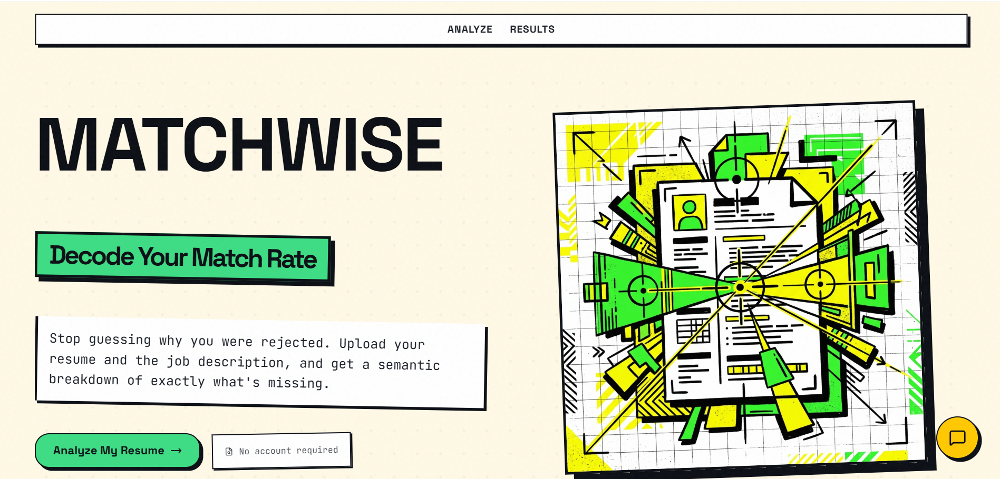
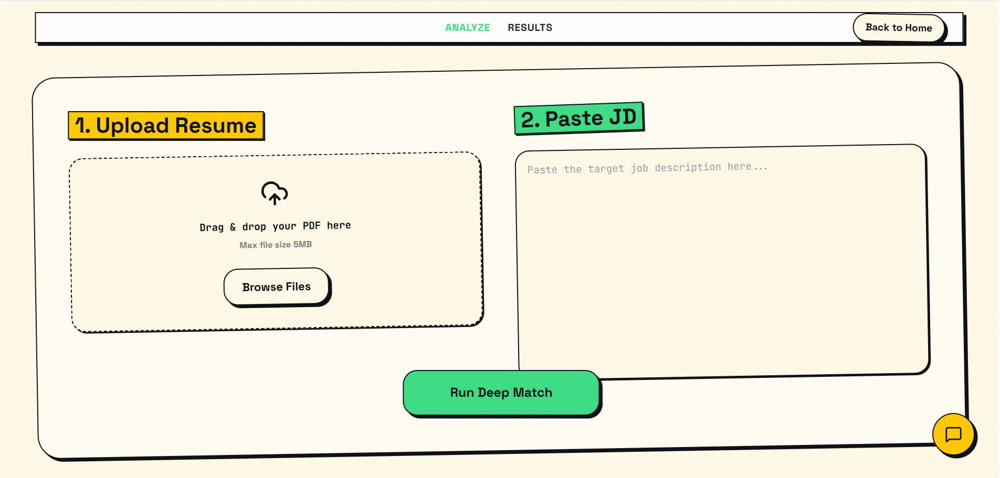
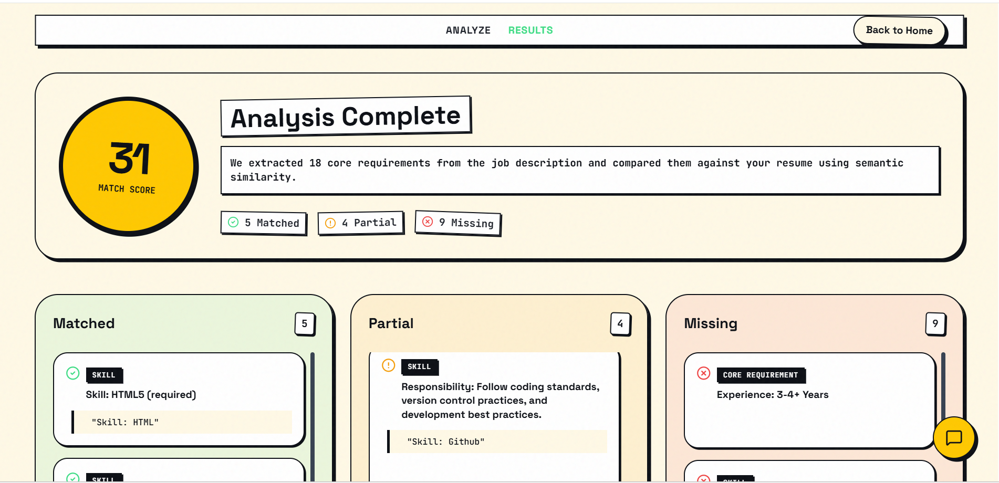
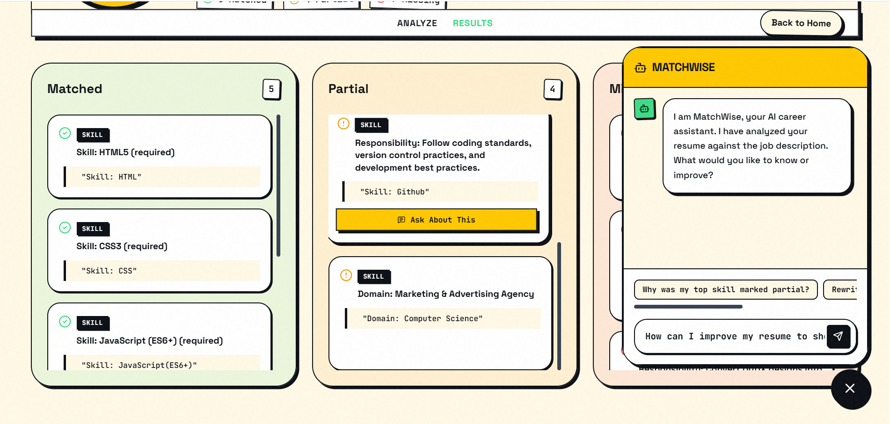
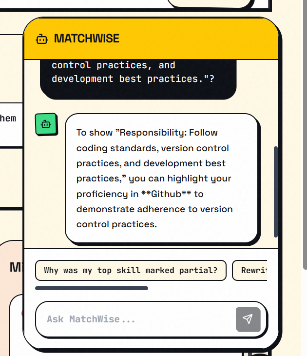

# MatchWise: Decode Your Match Rate

## Landing Page

The landing page introduces MatchWise with a bold, modern interface and clearly communicates the platform's purpose. Users can quickly begin analyzing their resumes without unnecessary friction.
 

**MatchWise** is a robust, AI-powered application designed to bridge the gap between candidate resumes and job descriptions. Instead of guessing why an application was rejected, MatchWise provides a deep semantic breakdown of exactly what is missing, partially matching, or aligned with a specific role.

## Resume & Job Description Upload

Users can upload their resume and provide a job description to start the analysis. The interface is designed to be intuitive, responsive, and accessible across devices.



## Match Results

The results page presents an overall compatibility score along with detailed insights into matched skills, missing keywords, and personalized recommendations to improve ATS performance.


## Skills Comparison

A detailed comparison highlights skills present in the resume, skills required by the job description, and areas that need improvement for better matching.



## Matchwise AI ChatBot

An integrated AI chatbot helps users navigate the platform, answer resume-related questions, and provide instant guidance throughout the analysis process. It delivers contextual responses, making the resume optimization experience more interactive and user-friendly.



## 🚀 Features

- **Semantic Matching**: Utilizes `sentence-transformers` for deep NLP semantic comparison between your resume and the target job description.
- **Categorized Breakdown**: Clearly delineates your profile into Matched, Partial, and Missing requirements.
- **AI Career Assistant**: Features a grounded, contextual chatbot powered by OpenAI. You can directly chat with your resume and the job description to ask things like, *"How do I rewrite my weakest bullet point?"* or *"Why was this skill marked missing?"*
- **Stateless & Secure**: Built with privacy in mind. Files are processed in-memory and discarded. No data is stored, and no accounts are required.
- **Neo-brutalist Aesthetic**: A striking, highly-responsive, and modern UI built with TailwindCSS.

## 🏗️ Architecture

- **Frontend**: React 19, Vite, Tailwind CSS v3.4, GSAP (Animations), Lucide React.
- **Backend**: Flask (Python 3), `sentence-transformers` (Embeddings), `pdfplumber` (PDF Parsing), OpenAI API.
- **Security Posture**: Fully audited. Features strict API Rate Limiting (Flask-Limiter), restricted CORS, XSS protection (DOMPurify), and server-side file validation.

## ⚙️ Local Development

### Prerequisites
- Node.js (v18+)
- Python 3.10+
- An OpenAI API Key

### Installation

1. **Clone the repository:**
   ```bash
   git clone https://github.com/Kandpalharsha/Resume-Matching.git
   cd Resume-Matching
   ```

2. **Set up the Backend:**
   ```bash
   cd backend
   python -m venv venv
   source venv/bin/activate  # On Windows use: .\venv\Scripts\activate
   pip install -r requirements.txt
   ```

3. **Configure Environment Variables:**
   Create a `.env` file in the `backend/` directory:
   ```env
   OPENAI_API_KEY=your_openai_api_key_here
   ```

4. **Set up the Frontend:**
   ```bash
   cd ../frontend
   npm install
   ```

### Running the App

You can run both the frontend and backend simultaneously using the provided startup script (on Windows):
```powershell
./start.ps1
```

Alternatively, run them separately:
- **Backend**: `cd backend && python app.py` (Runs on `http://localhost:5000`)
- **Frontend**: `cd frontend && npm run dev` (Runs on `http://localhost:5173`)

## 🛡️ Security

MatchWise underwent a comprehensive security audit. Protections in place include:
- **Rate Limiting**: OpenAI endpoints are protected to prevent abuse.
- **CORS Lockdown**: Only whitelisted local origins can access the API.
- **XSS Sanitization**: All AI-generated responses are sanitized via DOMPurify before rendering.
- **Strict File Validation**: Enforces `application/pdf` MIME typing and 5MB size limits.

## 🤝 Contributing

Contributions, issues, and feature requests are welcome. Feel free to check the issues page if you want to contribute.

## 📝 License

This project is open-source and available under the [MIT License](LICENSE).
